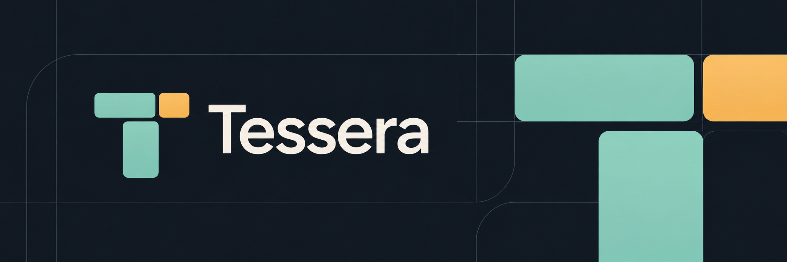

# Tessera

A desktop terminal workspace with a single Overview of real Claude Code and Codex sessions.

**0.2.1 fixes terminal closing and workspace dialog submission.** It combines real login-shell PTYs, resizable splits, keyboard navigation, persistent workspace metadata, and a hook-driven agent Overview. Specification editing, issue connectors, and detached session hosting follow in later increments.

## Start on macOS

With Rust stable and Xcode Command Line Tools installed:

```sh
git clone https://github.com/JeremySomsouk/tessera.git
cd tessera
cargo install --path . --locked
tessera
```

This starts the native desktop application. It uses `$SHELL` as a login shell (defaults to `/bin/zsh` on macOS) and preserves shell startup files. Run ordinary commands, Vim, SSH, `claude`, or `codex` directly in a pane.

To build a Finder application and release DMG:

```sh
bash scripts/bundle-macos.sh
open dist/Tessera.app
```

CI produces separate Intel (`Tessera-x86_64.dmg`) and Apple Silicon (`Tessera-arm64.dmg`) artifacts in the **Build and verify** workflow. Open the DMG and drag Tessera to Applications before installing hooks. Bundles are ad-hoc signed, not notarized; macOS may require Open from the application's context menu.

To publish a version, tag the release commit containing this workflow and push the tag:

```sh
git tag v0.2.1
git push origin v0.2.1
```

Pushing a version tag (`v` followed by a digit) runs all checks and builds both DMGs, then publishes them on the [GitHub Releases page](https://github.com/JeremySomsouk/tessera/releases) with checked-in release notes when available, otherwise generated notes. New releases stay in draft until both assets upload successfully. A failed publishing job can be rerun to finish the release. Branch pushes and pull requests upload Actions artifacts only.

## Connect Codex CLI

Install Codex separately and use its normal login. Preview and install Tessera's observational lifecycle hooks:

```sh
tessera codex-hooks           # preview definitions
tessera install-codex-hooks   # merge with backup into $CODEX_HOME/hooks.json
codex                        # run inside a Tessera pane; open /hooks to review and trust
```

When `CODEX_HOME` is unset, the default is `~/.codex/hooks.json`. A custom file can be passed explicitly to the install/uninstall commands. Use a Codex release with lifecycle hooks, review and trust Tessera's exact definitions in `/hooks`, and restart the session if needed. Hooks disabled by user or administrator policy remain disabled. Existing inline hooks in `config.toml` remain untouched; Codex may warn about both representations in one config layer.

Codex and Claude sessions share **Cmd+Shift+O** Overview, with an agent label and independent identities even when session IDs match. Start/prompt/tool events show running activity, permission requests need attention, Stop marks response completion, Interrupt needs input, and SessionEnd ends tracking. Approval decisions stay in Codex's terminal; task review/acceptance stays explicit.

```sh
tessera uninstall-codex-hooks # removes only commands from this executable location
```

No API key, paid session, transcript scanning, `notify` replacement, or hook-trust bypass is introduced. The existing 64 KiB per-hook input limit also applies to Codex; larger tool payloads cannot be tracked. Older `notify`-only Codex versions, remote/Cloud sessions, and separately identified subagent cards are outside this increment. See [integration details](docs/integration.md).

## Connect Claude Code

Tessera does not replace Claude, use an API key, or start paid sessions automatically. Install Claude Code separately and use its normal login.

```sh
tessera hooks          # preview the exact settings additions
tessera install-hooks  # merge into ~/.claude/settings.json, retaining a backup
```

Then run `claude` in a Tessera pane. Press **Cmd+Shift+O** to see sessions, inspect their recorded activity, and return to the existing terminal. Run `/hooks` in Claude to check the integration against your installed version. Existing Claude sessions may need a restart to load configuration changes.

If using the bundle rather than a CLI install, run these commands with `"/Applications/Tessera.app/Contents/MacOS/tessera"` instead of `tessera`.

The helper runs only when `TESSERA_SOCKET` is inherited from a Tessera shell. Outside Tessera it is a no-op. Permission and input responses happen in the real CLI. `Stop` means a response finished; it never accepts a task automatically. Task titles and explicit review/acceptance actions are in the Overview inspector.

Uninstall using the same executable location:

```sh
tessera uninstall-hooks
```

See [integration details](docs/integration.md), including custom settings paths and stale executable paths.

## Keyboard

On macOS, `Command` below is Cmd. On Linux, use Ctrl+Alt so ordinary terminal Ctrl shortcuts remain available.

| Action | Shortcut |
| --- | --- |
| Overview / previous terminal | Command+Shift+O |
| New workspace in the current configured directory | Command+T |
| Side-by-side split | Command+D |
| Stacked split | Command+Shift+D |
| Maximize / restore pane | Command+Shift+Enter |
| Next pane | Command+Alt+Right |
| Find in the focused terminal | Command+F |
| Keyboard copy mode | Command+Shift+Space |
| Workspace 1–9 | Command+1–9 |
| Workspace picker / commands | Command+Shift+P |
| Session needing attention | Command+Shift+N |
| Stop pane, with confirmation | Command+W |

Stopping the last pane removes its workspace; task history is retained.

In Overview, Up/Down select a session, Enter opens its terminal, and Escape returns. These keys remain normal terminal input in a pane. Drag split separators to resize. Drag terminal text to select; Cmd+C copies, Cmd+V pastes. Shift bypasses terminal mouse reporting for selection. Use the font slider and Light/Dark button in the toolbar. Hover actions and workspace tabs to see their shortcuts. Workspace number shortcuts follow tab position and support the physical number row on layouts such as AZERTY. In the workspace dialog, Enter in Working directory creates a workspace; Enter in Find workspace opens the first match. Invalid directories show an error inside the dialog and keep it open for correction.

Normal terminal typing uses a slim beam caret; applications can request block, underline, beam or hidden cursors. Terminal color queries report the actual palette and application overrides, so dark-theme detection uses the real background.

**Terminal search:** use Command+F (Ctrl+Alt+F on Linux) or the pane’s Find button. Search is literal and case-sensitive across the current screen and retained scrollback. Enter / Shift+Enter and Next / Previous navigate matches, wrapping at the ends; Escape closes search and restores terminal input. Only the current match is highlighted. Output changes or resizing clear the highlight; press Enter to search again. Queries stay in memory and are never sent to the shell or saved. Search follows Alacritty’s base-cell text semantics: wide characters and wrapped lines work, but combining marks are omitted and text hidden in the other terminal screen is excluded.

**Keyboard selection:** Command+Shift+Space (Ctrl+Alt+Shift+Space on Linux) or the pane’s Select button enters copy mode. Arrows (or H/J/K/L), Home/End and Page Up/Down move the selection cursor; Ctrl+Left/Right move by word. Shift extends a selection, and Space or V toggles selection at the cursor. The normal copy shortcut copies without leaving; Enter copies and returns to the live terminal, while Escape cancels. Typed text, paste and IME commits are suppressed during copy mode. Selection uses the active screen and retained scrollback, including after the shell exits. Opening Find leaves copy mode; entering copy mode closes Find.

## Recovery and current boundaries

Workspace directories, task identities/titles/statuses, layouts, themes, font sizes, and bounded session histories are saved locally. On restart, previous sessions are marked disconnected. **Resume workspace starts fresh login shells**; old Claude session histories remain available. Closing a pane stops its shell; quitting the app stops hosted shells. Independently detached `nohup`/daemon processes are outside this lifecycle.

This increment has one application window, no external session daemon, no remote SSH tracking, no specification editor, and no Jira/GitHub connector. Hook histories contain event/tool names, not prompts, arguments, results, transcripts, or permission decisions. Ordinary terminal output remains in memory only. The terminal renderer is an initial implementation; see [compatibility](docs/terminal-compatibility.md) before treating it as a replacement for a mature terminal.

## Development

```sh
cargo fmt --all -- --check
cargo clippy --locked --all-targets -- -D warnings
cargo test --locked
# Includes the local socket transport test on an unrestricted host:
cargo test --locked -- --include-ignored
```

Linux builds need `libxkbcommon-dev`, `libwayland-dev`, and `libegl1-mesa-dev`. The UI also opens on Linux; macOS remains the release target. No Windows frontend is implemented.

[Architecture](docs/architecture.md) · [Progress](PROGRESS.md) · [Next increments](TODO.md) · [Performance](docs/performance.md)
